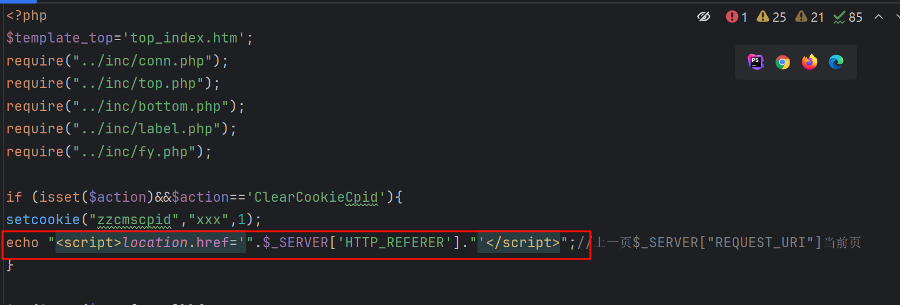
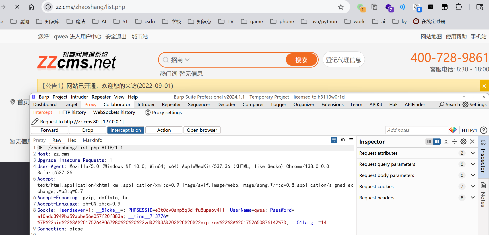
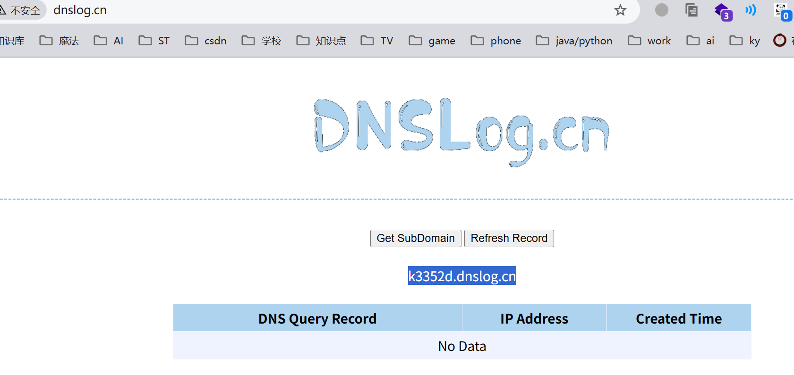
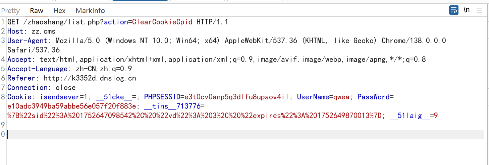

漏洞一 开放重定向漏洞

路由地址： /zhaoshang/list.php

找到可控变量 $_SERVER
 

这段代码用于删除名为“zzcmscpid”的cookie后，通过JavaScript跳转到请求的来源页（Referer），但未对Referer进行任何验证。

验证漏洞

首先访问该页面

http://zz.cms/zhaoshang/list.php
 

 

尝试构造Referer

  

  

发放数据包，发现页面跳转，dnslog有回显数据

  
   
